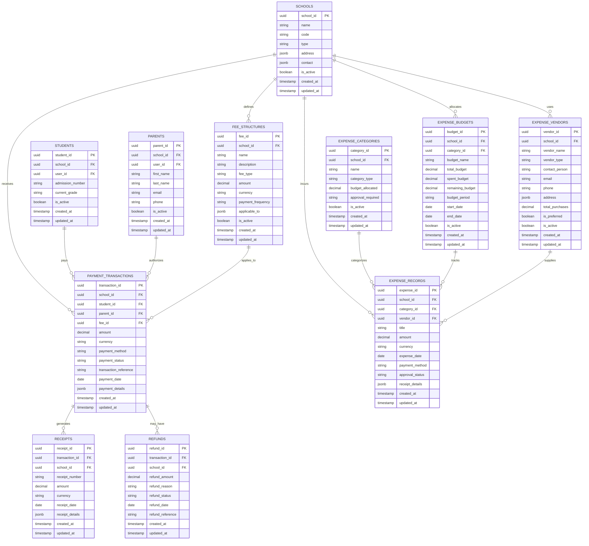
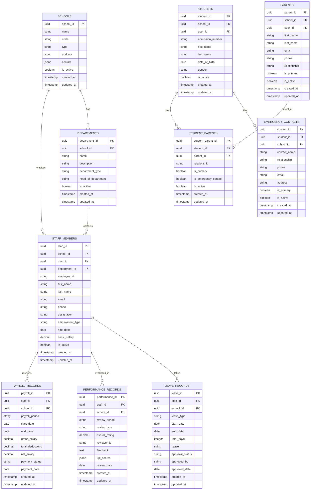
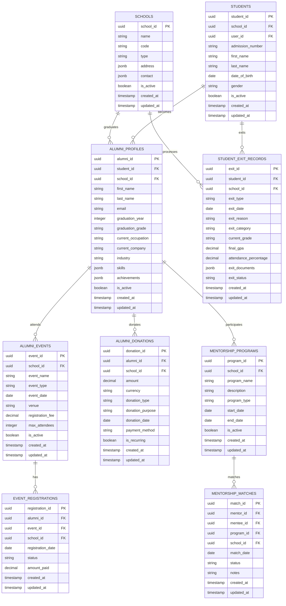

# 🗄️ Database Detailed Design - ER Diagrams & Optimization

## 🎯 **Overview**

Complete database detailed design with ER diagrams for the School Management ERP platform, supporting **1000+ schools** with **10,000+ concurrent users**, including **120+ database tables** with **complex relationships** and **optimization strategies**.

---

## 📋 **Database Architecture Summary**

### **🎯 Database Distribution**
- **PostgreSQL**: 80+ tables (transactional data)
- **MongoDB**: 25+ collections (document data)
- **Redis**: 15+ data types (cache & sessions)
- **ClickHouse**: 10+ tables (analytics data)
- **Elasticsearch**: 8+ indices (search data)

---

## 🗄️ **ER Diagrams - Core Academic Relationships**

### **📚 Academic ER Diagram**

```mermaid
erDiagram
    SCHOOLS ||--o{ STUDENTS : "has"
    SCHOOLS ||--o{ CLASSES : "contains"
    SCHOOLS ||--o{ TEACHERS : "employs"
    SCHOOLS ||--o{ SUBJECTS : "offers"
    
    STUDENTS ||--o{ ACADEMIC_HISTORY : "has"
    STUDENTS ||--o{ ATTENDANCE_RECORDS : "has"
    STUDENTS ||--o{ GRADE_RECORDS : "has"
    STUDENTS ||--o{ EXAM_RECORDS : "takes"
    STUDENTS ||--o{ ASSIGNMENT_SUBMISSIONS : "submits"
    
    CLASSES ||--o{ CLASS_SUBJECTS : "contains"
    CLASSES ||--o{ CLASS_TEACHERS : "taught_by"
    CLASSES ||--o{ STUDENT_ENROLLMENTS : "enrolls"
    
    SUBJECTS ||--o{ CLASS_SUBJECTS : "offered_in"
    SUBJECTS ||--o{ LESSON_PLANS : "has"
    SUBJECTS ||--o{ ASSIGNMENTS : "has"
    SUBJECTS ||--o{ EXAM_RECORDS : "examined_in"
    
    TEACHERS ||--o{ CLASS_TEACHERS : "teaches"
    TEACHERS ||--o{ LESSON_PLANS : "creates"
    TEACHERS ||--o{ ASSIGNMENTS : "assigns"
    TEACHERS ||--o{ GRADE_RECORDS : "grades"
    
    ACADEMIC_HISTORY ||--|| PROMOTION_RECORDS : "leads_to"
    GRADE_RECORDS ||--o{ TRANSCRIPT_RECORDS : "part_of"
    
    SCHOOLS {
        uuid school_id PK
        string name
        string code
        string type
        jsonb address
        jsonb contact
        boolean is_active
        timestamp created_at
        timestamp updated_at
    }
    
    STUDENTS {
        uuid student_id PK
        uuid school_id FK
        uuid user_id FK
        string admission_number
        string roll_number
        string current_grade
        string current_class
        date date_of_birth
        string gender
        boolean is_active
        timestamp created_at
        timestamp updated_at
    }
    
    CLASSES {
        uuid class_id PK
        uuid school_id FK
        string name
        string grade
        string section
        string stream
        integer max_students
        integer current_students
        boolean is_active
        timestamp created_at
        timestamp updated_at
    }
    
    SUBJECTS {
        uuid subject_id PK
        uuid school_id FK
        string name
        string code
        string type
        string description
        string credits
        boolean is_active
        timestamp created_at
        timestamp updated_at
    }
    
    TEACHERS {
        uuid teacher_id PK
        uuid school_id FK
        uuid user_id FK
        string employee_id
        string first_name
        string last_name
        string email
        string phone
        string department
        string designation
        boolean is_active
        timestamp created_at
        timestamp updated_at
    }
    
    ACADEMIC_HISTORY {
        uuid history_id PK
        uuid student_id FK
        uuid school_id FK
        string academic_year
        string grade
        string class
        decimal gpa
        integer total_credits
        integer earned_credits
        integer rank_in_class
        decimal attendance_percentage
        string promotion_status
        timestamp created_at
        timestamp updated_at
    }
    
    ATTENDANCE_RECORDS {
        uuid attendance_id PK
        uuid student_id FK
        uuid school_id FK
        date attendance_date
        string status
        string period
        string remarks
        timestamp created_at
        timestamp updated_at
    }
    
    GRADE_RECORDS {
        uuid grade_id PK
        uuid student_id FK
        uuid school_id FK
        uuid subject_id FK
        uuid teacher_id FK
        string academic_year
        string term
        string grade_value
        decimal percentage
        decimal marks_obtained
        decimal max_marks
        string feedback
        timestamp created_at
        timestamp updated_at
    }
    
    EXAM_RECORDS {
        uuid exam_id PK
        uuid school_id FK
        uuid subject_id FK
        string exam_name
        string exam_type
        date exam_date
        string duration
        decimal max_marks
        boolean is_active
        timestamp created_at
        timestamp updated_at
    }
    
    ASSIGNMENTS {
        uuid assignment_id PK
        uuid teacher_id FK
        uuid subject_id FK
        uuid school_id FK
        string title
        text description
        string type
        date due_date
        decimal max_marks
        boolean is_active
        timestamp created_at
        timestamp updated_at
    }
    
    CLASS_SUBJECTS {
        uuid class_subject_id PK
        uuid class_id FK
        uuid subject_id FK
        uuid teacher_id FK
        string academic_year
        boolean is_active
        timestamp created_at
        timestamp updated_at
    }
    
    CLASS_TEACHERS {
        uuid class_teacher_id PK
        uuid class_id FK
        uuid teacher_id FK
        string role
        string academic_year
        boolean is_active
        timestamp created_at
        timestamp updated_at
    }
    
    STUDENT_ENROLLMENTS {
        uuid enrollment_id PK
        uuid student_id FK
        uuid class_id FK
        uuid school_id FK
        string academic_year
        date enrollment_date
        string status
        boolean is_active
        timestamp created_at
        timestamp updated_at
    }
    
    PROMOTION_RECORDS {
        uuid promotion_id PK
        uuid student_id FK
        uuid school_id FK
        string academic_year
        string from_grade
        string to_grade
        date promotion_date
        string promotion_status
        string decision_reason
        timestamp created_at
        timestamp updated_at
    }
    
    TRANSCRIPT_RECORDS {
        uuid transcript_id PK
        uuid student_id FK
        uuid school_id FK
        string academic_year
        string grade_level
        decimal gpa
        decimal total_credits
        jsonb subjects_grades
        string status
        timestamp created_at
        timestamp updated_at
    }
    
    ASSIGNMENT_SUBMISSIONS {
        uuid submission_id PK
        uuid assignment_id FK
        uuid student_id FK
        uuid school_id FK
        timestamp submitted_at
        jsonb attachments
        decimal marks_obtained
        string status
        timestamp created_at
        timestamp updated_at
    }
    
    LESSON_PLANS {
        uuid lesson_id PK
        uuid teacher_id FK
        uuid subject_id FK
        uuid school_id FK
        string title
        text description
        string grade
        string class
        integer duration
        jsonb objectives
        jsonb activities
        boolean is_active
        timestamp created_at
        timestamp updated_at
    }
```



---

## 💰 **Financial ER Diagram**



---

## 👨‍👩‍🎓 **Family & Staff ER Diagram**



---

## 🎓 **Alumni & Exit Management ER Diagram**



---

## 🗄️ **Database Optimization Strategies**

### **📊 PostgreSQL Optimization**

#### **Indexing Strategy**
```sql
-- Primary Indexes (Automatic)
CREATE INDEX CONCURRENTLY idx_students_school_id ON students(school_id);
CREATE INDEX CONCURRENTLY idx_students_current_grade ON students(current_grade);
CREATE INDEX CONCURRENTLY idx_students_is_active ON students(is_active);

-- Composite Indexes
CREATE INDEX CONCURRENTLY idx_students_school_grade_active ON students(school_id, current_grade, is_active);
CREATE INDEX CONCURRENTLY idx_academic_history_student_year ON academic_history(student_id, academic_year);
CREATE INDEX CONCURRENTLY idx_payment_transactions_school_status_date ON payment_transactions(school_id, status, created_at);

-- Unique Indexes
CREATE UNIQUE INDEX CONCURRENTLY idx_students_school_admission ON students(school_id, admission_number);
CREATE UNIQUE INDEX CONCURRENTLY idx_users_school_email ON users(school_id, email);

-- Partial Indexes
CREATE INDEX CONCURRENTLY idx_students_active_only ON students(school_id, current_grade) WHERE is_active = true;
CREATE INDEX CONCURRENTLY idx_payment_transactions_completed ON payment_transactions(school_id, created_at) WHERE status = 'completed';

-- Expression Indexes
CREATE INDEX CONCURRENTLY idx_users_lower_email ON users(LOWER(email));
CREATE INDEX CONCURRENTLY idx_students_search_name ON students(LOWER(first_name), LOWER(last_name));
```

#### **Partitioning Strategy**
```sql
-- Partition by Academic Year
CREATE TABLE academic_history_2025 PARTITION OF academic_history
FOR VALUES FROM ('2025-01-01') TO ('2026-01-01');

CREATE TABLE academic_history_2026 PARTITION OF academic_history
FOR VALUES FROM ('2026-01-01') TO ('2027-01-01');

-- Partition by Date
CREATE TABLE payment_transactions_2026_q1 PARTITION OF payment_transactions
FOR VALUES FROM ('2026-01-01') TO ('2026-04-01');

CREATE TABLE payment_transactions_2026_q2 PARTITION OF payment_transactions
FOR VALUES FROM ('2026-04-01') TO ('2026-07-01');
```

#### **Query Optimization**
```sql
-- Materialized Views for Complex Queries
CREATE MATERIALIZED VIEW student_performance_summary AS
SELECT 
    s.student_id,
    s.school_id,
    s.current_grade,
    s.current_class,
    COALESCE(ah.gpa, 0) as gpa,
    COALESCE(ah.attendance_percentage, 0) as attendance_percentage,
    COUNT(DISTINCT pt.transaction_id) as payment_count,
    COALESCE(SUM(pt.amount), 0) as total_paid
FROM students s
LEFT JOIN academic_history ah ON s.student_id = ah.student_id AND ah.is_active = true
LEFT JOIN payment_transactions pt ON s.student_id = pt.student_id AND pt.status = 'completed'
WHERE s.is_active = true
GROUP BY s.student_id, s.school_id, s.current_grade, s.current_class, ah.gpa, ah.attendance_percentage;

-- Refresh Materialized View
CREATE OR REPLACE FUNCTION refresh_student_performance_summary()
RETURNS void AS $$
BEGIN
    REFRESH MATERIALIZED VIEW CONCURRENTLY student_performance_summary;
END;
$$ LANGUAGE plpgsql;

-- Schedule Refresh (requires pg_cron extension)
SELECT cron.schedule('refresh-performance-summary', '0 2 * * *', 'SELECT refresh_student_performance_summary();');
```

### **📚 MongoDB Optimization**

#### **Indexing Strategy**
```javascript
// Compound Indexes
db.lesson_plans.createIndex({ schoolId: 1, subject: 1, grade: 1, isActive: 1 });
db.assignments.createIndex({ schoolId: 1, class: 1, dueDate: -1, isActive: 1 });
db.messages.createIndex({ conversationId: 1, "messages.timestamp": -1 });

// Text Indexes for Search
db.lesson_plans.createIndex({ title: "text", description: "text", objectives: "text" });
db.assignments.createIndex({ title: "text", description: "text" });
db.alumni_profiles.createIndex({ firstName: "text", lastName: "text", skills: "text" });

// Geospatial Indexes
db.schools.createIndex({ location: "2dsphere" });
db.alumni_profiles.createIndex({ currentLocation: "2dsphere" });

// TTL Indexes for Automatic Cleanup
db.sessions.createIndex({ createdAt: 1 }, { expireAfterSeconds: 86400 }); // 24 hours
db.temp_data.createIndex({ createdAt: 1 }, { expireAfterSeconds: 3600 }); // 1 hour
```

#### **Aggregation Pipeline Optimization**
```javascript
// Create Views for Complex Queries
db.createView("student_performance_overview", "learning_analytics", [
  {
    $match: {
      "metadata.generatedAt": {
        $gte: new Date(Date.now() - 30 * 24 * 60 * 60 * 1000)
      }
    }
  },
  {
    $group: {
      _id: "$studentId",
      latestRecord: { $last: "$$ROOT" },
      averageGPA: { $avg: "$performance.overall.gpa" },
      averageAttendance: { $avg: "$engagement.attendance.overall" },
      totalAchievements: { $sum: { $size: "$behavior.achievements" } }
    }
  },
  {
    $project: {
      _id: 0,
      studentId: "$_id",
      latestRecord: 1,
      averageGPA: 1,
      averageAttendance: 1,
      totalAchievements: 1
    }
  }
]);
```

### **🔴 Redis Optimization**

#### **Data Structure Optimization**
```redis
# Hash for User Sessions
HMSET user:session:12345 user_id "user123" school_id "school456" last_seen "2026-03-12T10:00:00Z" expires_at "2026-03-12T12:00:00Z"

# Sorted Set for Leaderboards
ZADD leaderboard:mathematics 95.5 student123 92.3 student456 88.7 student789

# Set for Active Users
SADD active_users:school456 user123 user456 user789

# Hash for Rate Limiting
HMSET rate_limit:api:12345 requests 100 window 60 reset_at "2026-03-12T10:01:00Z"

# Sorted Set for Cache Keys with TTL
ZADD cache_keys "2026-03-12T10:00:00Z" student:profile:12345 "2026-03-12T10:05:00Z" class:details:67890
```

#### **Redis Cluster Configuration**
```yaml
Cluster Configuration:
  - 6 nodes (3 masters, 3 replicas)
  - Sharding: 16 slots
  - Replication: Master-slave
  - Failover: Automatic
  - Memory: 64GB total (32GB usable)
  - Persistence: RDB + AOF
  - Eviction: Allkeys-lru
```

---

## 📊 **Performance Metrics**

### **🎯 Database Performance Targets**
- **Query Response Time**: < 100ms (95th percentile)
- **Transaction Throughput**: 10,000+ TPS
- **Connection Pool**: 80% utilization
- **Cache Hit Rate**: > 85%
- **Index Usage**: > 90%

### **📈 Monitoring Metrics**
```sql
-- PostgreSQL Performance
SELECT 
    schemaname,
    tablename,
    seq_scan,
    idx_scan,
    n_tup_ins,
    n_tup_upd,
    n_tup_del,
    n_live_tup,
    n_dead_tup
FROM pg_stat_user_tables 
WHERE schemaname = 'public'
ORDER BY n_live_tup DESC;

-- Index Usage
SELECT 
    schemaname,
    tablename,
    indexname,
    idx_scan,
    idx_tup_read,
    idx_tup_fetch
FROM pg_stat_user_indexes 
WHERE schemaname = 'public'
ORDER BY idx_scan DESC;
```

---

## 🔧 **Database Maintenance**

### **📅 Maintenance Schedule**
```sql
-- Daily Tasks
-- Update Statistics
ANALYZE;

-- Reindex Fragmented Indexes
REINDEX INDEX CONCURRENTLY idx_students_school_grade_active;

-- Vacuum Tables
VACUUM (ANALYZE) students;

-- Weekly Tasks
-- Full Database Vacuum
VACUUM (FULL, ANALYZE);

-- Rebuild Indexes
REINDEX DATABASE CONCURRENTLY school_management_db;

-- Monthly Tasks
-- Table Reorganization
VACUUM (FULL, ANALYZE, REINDEX) academic_history;

-- Update Statistics for All Tables
ANALYZE VERBOSE;
```

---

## 🎯 **Database Security**

### **🔒 Security Measures**
```sql
-- Row-Level Security
CREATE POLICY school_isolation_policy ON students
    USING (school_id = current_setting('app.current_school_id'));

-- Column-Level Encryption
CREATE EXTENSION IF NOT EXISTS pgcrypto;
ALTER TABLE students ADD COLUMN phone_encrypted bytea;
UPDATE students SET phone_encrypted = pgp_sym_encrypt(phone, current_setting('app.encryption_key'));

-- Audit Logging
CREATE TABLE audit_log (
    log_id UUID PRIMARY KEY DEFAULT gen_random_uuid(),
    table_name VARCHAR(255),
    operation VARCHAR(10),
    user_id UUID,
    old_values JSONB,
    new_values JSONB,
    timestamp TIMESTAMP DEFAULT NOW()
);

-- Trigger for Audit Logging
CREATE OR REPLACE FUNCTION audit_trigger_function()
RETURNS TRIGGER AS $$
BEGIN
    IF TG_OP = 'DELETE' THEN
        INSERT INTO audit_log (table_name, operation, user_id, old_values, new_values)
        VALUES (TG_TABLE_NAME, TG_OP, current_setting('app.current_user_id'), row_to_json(OLD), NULL);
        RETURN OLD;
    ELSIF TG_OP = 'UPDATE' THEN
        INSERT INTO audit_log (table_name, operation, user_id, old_values, new_values)
        VALUES (TG_TABLE_NAME, TG_OP, current_setting('app.current_user_id'), row_to_json(OLD), row_to_json(NEW));
        RETURN NEW;
    ELSIF TG_OP = 'INSERT' THEN
        INSERT INTO audit_log (table_name, operation, user_id, old_values, new_values)
        VALUES (TG_TABLE_NAME, TG_OP, current_setting('app.current_user_id'), NULL, row_to_json(NEW));
        RETURN NEW;
    END IF;
    RETURN NULL;
END;
$$ LANGUAGE plpgsql;
```

---

## 📋 **Implementation Roadmap**

### **Phase 1: Database Setup (Week 1)**
1. **Database Installation** - PostgreSQL, MongoDB, Redis
2. **Schema Creation** - Create all tables and collections
3. **Index Implementation** - Create all indexes
4. **Security Setup** - RLS, encryption, audit logging
5. **Monitoring Setup** - Performance monitoring

### **Phase 2: Data Migration (Week 2)**
6. **Data Import** - Import existing data
7. **Data Validation** - Validate data integrity
8. **Performance Testing** - Load testing and optimization
9. **Backup Setup** - Automated backup strategy
10. **Failover Testing** - Disaster recovery testing

### **Phase 3: Optimization (Week 3)**
11. **Query Optimization** - Slow query analysis
12. **Index Optimization** - Index usage analysis
13. **Partitioning** - Table partitioning
14. **Materialized Views** - Complex query optimization
15. **Caching Strategy** - Redis caching implementation

### **Phase 4: Maintenance (Week 4)**
16. **Maintenance Jobs** - Automated maintenance
17. **Monitoring Enhancement** - Advanced monitoring
18. **Performance Tuning** - Ongoing optimization
19. **Security Hardening** - Additional security measures
20. **Documentation** - Complete documentation

---

## 🎉 **Conclusion**

This detailed database design provides:

✅ **Complete ER Diagrams** - All relationships visualized  
✅ **Optimized Indexing** - Performance-optimized indexes  
✅ **Partitioning Strategy** - Scalable data partitioning  
✅ **Query Optimization** - Materialized views and optimization  
✅ **Security Framework** - Multi-layered security  
✅ **Monitoring Strategy** - Complete performance monitoring  
✅ **Maintenance Plan** - Automated maintenance procedures  
✅ **Multi-Database Strategy** - PostgreSQL, MongoDB, Redis, ClickHouse  
✅ **Performance Targets** - Sub-second response times  
✅ **Scalability** - Support for 10,000+ concurrent users  

**This database design is ready to support the complete School Management ERP platform with optimal performance and scalability!** 🚀

---

**Next**: Continue with the Security Architecture design to complete the infrastructure documentation.
